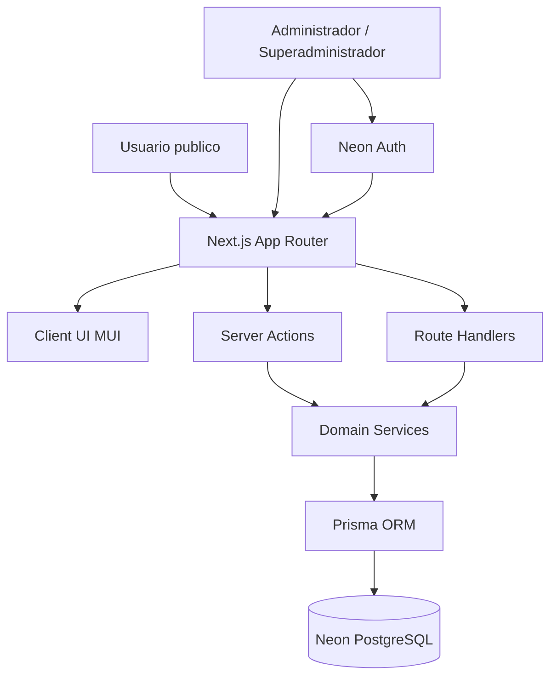
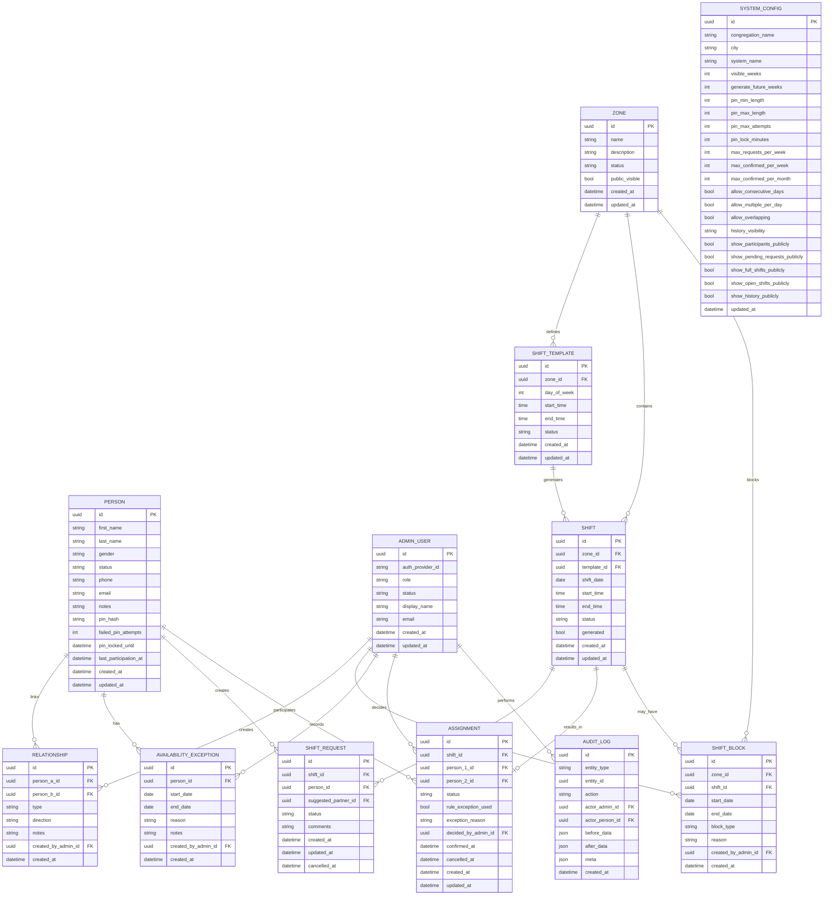
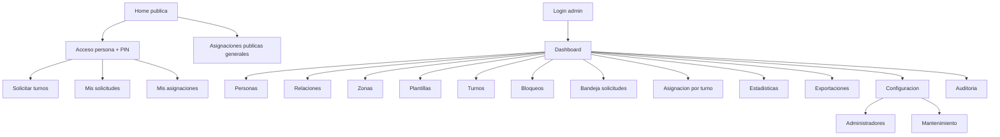
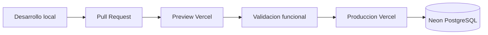

# Fase 1 - Arquitectura y Diseno

## 1. Objetivo

Disenar una aplicacion web mobile first para gestionar solicitudes y asignaciones de turnos en zonas geograficas de publicaciones para una sola congregacion por instalacion.

Restricciones clave:

- Stack obligatorio: Next.js App Router, TypeScript, MUI, Next.js Server Actions, Route Handlers, PostgreSQL en Neon, Prisma ORM, Neon Auth, Vercel.
- Solo administradores y superadministradores requieren autenticacion formal.
- Los usuarios publicos acceden mediante seleccion de persona + PIN.
- La aplicacion debe ser instalable como PWA.
- No se implementa modo offline transaccional.
- Debe incluir datos demo y documentacion operativa completa.

## 2. Supuestos de arquitectura

- Una instalacion corresponde a una sola congregacion.
- Los turnos pertenecen a zonas, no a carritos individuales.
- Los datos historicos no se eliminan; su visibilidad se regula por configuracion.
- Las solicitudes son intenciones de participacion; las asignaciones confirmadas son la verdad operativa.
- El sistema no confirma automaticamente ninguna pareja.
- El administrador puede forzar decisiones fuera de regla, pero cada excepcion debe quedar auditada.

## 3. Arquitectura general

### 3.1 Estilo arquitectonico

Arquitectura modular monolitica sobre Next.js:

- Frontend SSR + Client Components selectivos para UX interactiva.
- Capa de aplicacion en Server Actions para comandos de negocio.
- Route Handlers para integraciones, exportaciones, PWA metadata y endpoints puntuales.
- Prisma como capa de acceso a datos.
- PostgreSQL en Neon como persistencia principal.
- Neon Auth para backoffice.

Esta decision reduce complejidad operativa, encaja bien con Vercel y mantiene suficiente separacion para crecer sin partir prematuramente a microservicios.

### 3.2 Diagrama de alto nivel



### 3.3 Modulos funcionales

- Public Access: busqueda de persona, validacion PIN, sesion publica temporal.
- Public Requests: listado de turnos disponibles, filtros, seleccion multiple, sugerencia de pareja, cancelacion.
- Public Assignments: consulta general publica y consulta personal protegida por PIN.
- People Management: personas, estado, PIN, observaciones, disponibilidad.
- Relationship Management: matrimonios, padre/madre-hijo/hija, excepciones administrativas.
- Territory Management: zonas, visibilidad, bloqueos, restricciones contextuales.
- Schedule Template Management: plantillas recurrentes y generacion futura.
- Request Review & Assignment: revision de solicitudes, confirmacion, rechazo, reemplazos, advertencias.
- Audit & Governance: auditoria, excepciones, configuraciones globales, mantenimiento.
- Analytics & Exports: metricas, PDF, Excel, calendarios imprimibles.

## 4. Capas de la aplicacion

### 4.1 Presentacion

- `app/` con App Router.
- MUI para componentes, formularios, tablas responsivas, dialogs y feedback.
- Enfoque mobile first con layouts compactos y acciones primarias visibles.

### 4.2 Aplicacion

- Server Actions para crear solicitudes, cancelar, administrar entidades, confirmar asignaciones y actualizar configuracion.
- Route Handlers para:
  - exportaciones (`/api/exports/...`)
  - manifiesto PWA y service worker
  - endpoints internos controlados para tareas programables
  - health checks administrativos

### 4.3 Dominio

Servicios de negocio separados por contexto:

- `person-service`
- `pin-auth-service`
- `relationship-service`
- `shift-template-service`
- `shift-generation-service`
- `request-service`
- `assignment-service`
- `restriction-service`
- `availability-service`
- `audit-service`
- `stats-service`
- `export-service`

### 4.4 Infraestructura

- Prisma repositories.
- Neon PostgreSQL.
- Neon Auth para sesiones administrativas.
- Vercel Cron o job invocable para mantener N semanas futuras.
- Almacenamiento efimero o streaming para exportaciones bajo demanda.

## 5. Modelo entidad-relacion



## 6. Entidades y reglas clave

### 6.1 Person

- Representa cualquier publicador utilizable por el sistema.
- `status=INACTIVE` bloquea solicitudes y asignaciones.
- El PIN se almacena con hash fuerte.
- Debe registrar intentos fallidos y bloqueo temporal.

### 6.2 Relationship

Tipos:

- `MARRIAGE`
- `PARENT_CHILD`
- `ADMIN_EXCEPTION`

Reglas:

- Matrimonio es bidireccional.
- Padre/madre-hijo/hija debe conservar direccion semantica.
- Excepcion administrativa requiere observacion obligatoria y creador identificado.

### 6.3 Zone

- Entidad geografica principal.
- Puede tener visibilidad publica configurable.

### 6.4 ShiftTemplate

- Define recurrencia semanal por zona.
- Cambios impactan generacion futura, nunca datos historicos ni turnos ya comprometidos.

### 6.5 Shift

Estados recomendados:

- `OPEN`
- `BLOCKED`
- `FULL`
- `CLOSED`

`FULL` es derivable, pero puede mantenerse como estado materializado para consultas rapidas si se necesita.

### 6.6 ShiftBlock

Tipos:

- `SPECIFIC_SHIFT`
- `FULL_DATE`
- `ZONE`
- `DATE_RANGE`

### 6.7 ShiftRequest

Estados:

- `PENDING`
- `CONFIRMED`
- `REJECTED`
- `CANCELLED`

Restriccion recomendada:

- Una persona no debe tener dos solicitudes activas para el mismo turno.

### 6.8 Assignment

- Cada turno puede tener exactamente dos personas confirmadas.
- Debe guardar si se uso excepcion administrativa.
- La confirmacion de una asignacion actualiza solicitudes relacionadas.

### 6.9 SystemConfig

- Configuracion singleton.
- Debe versionarse logicamente en auditoria.

### 6.10 AuditLog

- Fuente de trazabilidad operacional y de seguridad.
- Debe almacenar actor administrativo o actor publico segun corresponda.

## 7. Reglas de negocio prioritarias

### 7.1 Validacion de pareja

Una pareja es valida si se cumple al menos una condicion:

- mismo sexo
- matrimonio registrado
- relacion padre/madre-hijo/hija
- excepcion administrativa

Observacion de producto:

La regla "mismo sexo" por si sola amplia mucho las combinaciones. Debe permanecer parametrizable a futuro por si la congregacion necesita endurecerla sin cambiar codigo.

### 7.2 Restricciones de asignacion

El sistema debe advertir o bloquear segun configuracion:

- maximo de solicitudes por semana
- maximo de turnos confirmados por semana
- maximo de turnos confirmados por mes
- dias consecutivos
- mas de un turno por dia
- superposiciones horarias
- indisponibilidad personal
- estado inactivo
- bloqueos de zona, fecha o turno

### 7.3 Excepciones administrativas

- Si una regla se incumple, el sistema muestra advertencia explicita.
- El administrador puede continuar.
- Debe ingresar motivo o seleccionar motivo predefinido.
- Se registra en `AUDIT_LOG`.

### 7.4 Generacion automatica de turnos

- Se conserva un colchon de `generate_future_weeks`.
- El proceso agrega faltantes, no pisa turnos con actividad.
- Si una plantilla cambia, solo afecta generacion futura.

## 8. Casos de uso

### 8.1 Usuario publico

1. Buscar su nombre.
2. Ingresar PIN.
3. Ver turnos disponibles filtrando por zona y fecha.
4. Seleccionar multiples turnos.
5. Sugerir acompanante opcional.
6. Agregar observacion.
7. Enviar solicitudes.
8. Cancelar solicitudes pendientes.
9. Consultar asignaciones futuras.
10. Consultar historial si la configuracion lo permite.

### 8.2 Administrador

1. Iniciar sesion.
2. Gestionar personas y PIN.
3. Gestionar relaciones.
4. Gestionar zonas y plantillas.
5. Bloquear turnos/zonas/fechas.
6. Revisar solicitudes por turno.
7. Confirmar o rechazar combinaciones.
8. Aplicar excepciones administrativas.
9. Modificar o reemplazar asignaciones.
10. Consultar dashboard, alertas, estadisticas y exportaciones.

### 8.3 Superadministrador

1. Gestionar administradores.
2. Ajustar roles y permisos.
3. Configurar politicas globales.
4. Supervisar seguridad PIN.
5. Activar modo mantenimiento.

## 9. Pantallas requeridas

### 9.1 Publicas

- Home publica / acceso por persona + PIN
- Solicitud de turnos
- Confirmacion de solicitudes enviadas
- Mis solicitudes pendientes
- Consulta publica general de asignaciones
- Consulta personal de asignaciones por persona + PIN
- Mensaje informativo sin conexion

### 9.2 Administrativas

- Login administrativo
- Dashboard administrativo
- Gestion de personas
- Detalle/edicion de persona
- Gestion de relaciones
- Gestion de zonas
- Gestion de plantillas
- Gestion de turnos
- Gestion de bloqueos
- Bandeja de solicitudes
- Pantalla de asignacion centrada en turno
- Estadisticas
- Exportaciones
- Configuracion general
- Gestion de administradores
- Auditoria
- Mantenimiento

## 10. Navegacion propuesta



## 11. UX y lineamientos mobile first

- Barra inferior o acciones flotantes en vistas publicas.
- Filtros colapsables para no romper la vista movil.
- Tarjetas de turnos con fecha, horario, zona y estado.
- Seleccion multiple mediante checkboxes grandes y resumen persistente.
- Dashboard admin con KPIs compactos y lista priorizada de pendientes.
- Pantalla de asignacion orientada a una sola tarea: ver solicitudes del turno y confirmar pareja.
- Modo de advertencias claro con chips o banners para reglas incumplidas.

## 12. Estructura de carpetas propuesta

```text
src/
  app/
    (public)/
      page.tsx
      solicitar/
      solicitudes/
      asignaciones/
      acceso/
    (admin)/
      admin/
        login/
        dashboard/
        personas/
        relaciones/
        zonas/
        plantillas/
        turnos/
        bloqueos/
        solicitudes/
        asignaciones/
        estadisticas/
        exportaciones/
        configuracion/
        auditoria/
        mantenimiento/
    api/
      exports/
      health/
      pwa/
    manifest.ts
    layout.tsx
    globals.css
  components/
    ui/
    forms/
    tables/
    charts/
    layout/
    public/
    admin/
  features/
    auth/
    people/
    relationships/
    zones/
    templates/
    shifts/
    requests/
    assignments/
    availability/
    restrictions/
    config/
    stats/
    exports/
    audit/
  lib/
    prisma/
    auth/
    validations/
    dates/
    permissions/
    pwa/
  server/
    actions/
    services/
    repositories/
    policies/
  prisma/
    schema.prisma
    migrations/
    seed.ts
  public/
    icons/
    manifest/
  docs/
    fase-1-arquitectura.md
    decisiones/
```

## 13. Estrategia de seguridad

### 13.1 Autenticacion

- Backoffice: Neon Auth con sesiones para administradores y superadministradores.
- Frontend publico: sesion temporal propia basada en persona validada por PIN.

### 13.2 Autorizacion

Roles:

- `PUBLIC_PERSON`
- `ADMIN`
- `SUPERADMIN`

Controles:

- Middleware y verificaciones server-side por segmento administrativo.
- Permisos finos por accion sensible.

### 13.3 Seguridad de PIN

- Hash con algoritmo resistente, por ejemplo Argon2id o bcrypt con costo fuerte.
- Nunca almacenar ni loguear el PIN en texto plano.
- Rate limiting por persona e idealmente por IP para la pantalla publica de acceso.
- Bloqueo temporal despues de N intentos fallidos.
- Auditoria de reseteo/cambio de PIN.

### 13.4 Seguridad de datos

- Validacion estricta con esquemas compartidos.
- Sanitizacion de observaciones y comentarios.
- CSRF mitigado mediante uso preferente de Server Actions y protecciones nativas.
- Operaciones administrativas solo en servidor.
- Exportaciones auditadas cuando contienen datos personales.

### 13.5 Seguridad operativa

- Variables de entorno solo en servidor.
- Entornos separados dev/staging/prod.
- Mantenimiento accesible solo a superadministrador.

## 14. Estrategia de despliegue

### 14.1 Entornos

- Local
- Preview en Vercel
- Produccion en Vercel

### 14.2 Servicios externos

- Neon PostgreSQL
- Neon Auth

### 14.3 Pipeline recomendado



### 14.4 Jobs programados

- Cron diario o varias veces por dia para generar turnos faltantes del horizonte configurado.
- Job opcional para recalcular metricas materializadas si se decide optimizar reporting.

## 15. Estrategia de datos demo

La seed inicial debe incluir:

- personas ficticias activas e inactivas
- relaciones validas y excepciones
- zonas ficticias
- plantillas semanales
- turnos futuros
- solicitudes en distintos estados
- asignaciones confirmadas, canceladas y reemplazadas
- un superadministrador inicial
- al menos un administrador
- configuracion general inicial

## 16. Estrategia de observabilidad

- Auditoria funcional completa.
- Logging estructurado en servidor.
- Health endpoint simple para disponibilidad de aplicacion y DB.
- Indicadores visibles en dashboard para turnos sin cubrir y solicitudes pendientes.

## 17. Plan de implementacion por fases

### Fase 1 - Arquitectura y diseno

- Definicion funcional y tecnica.
- ERD y modulos.
- Seguridad, despliegue y roadmap.

### Fase 2 - Bootstrap tecnico

- Inicializacion de proyecto Next.js.
- Integracion TypeScript, MUI, Prisma y Neon.
- Base de layouts, tema, auth administrativa y estructura modular.
- PWA base.

### Fase 3 - Modelo de datos y seeds

- Prisma schema.
- Migraciones iniciales.
- Seeds demo.
- Configuracion singleton.

### Fase 4 - Modulos maestros

- Personas.
- Relaciones.
- Zonas.
- Plantillas.
- Bloqueos.
- Disponibilidad.

### Fase 5 - Flujo publico

- Busqueda de persona.
- Validacion PIN.
- Solicitud multiple de turnos.
- Cancelacion de pendientes.
- Consulta personal y publica.

### Fase 6 - Asignacion administrativa

- Bandeja de solicitudes.
- Vista centrada en turno.
- Validaciones de pareja.
- Confirmacion, rechazo, reemplazo y excepciones.

### Fase 7 - Automatizacion y reglas

- Generacion automatica de turnos.
- Aplicacion de restricciones configurables.
- Alertas operativas.

### Fase 8 - Estadisticas y exportaciones

- KPIs.
- Reportes.
- Excel, PDF y calendarios imprimibles.

### Fase 9 - Hardening y documentacion

- README detallado.
- Pruebas clave.
- Ajustes de seguridad, rendimiento y accesibilidad.
- Verificacion PWA y despliegue.

## 18. Riesgos identificados

### Riesgos funcionales

- Ambiguedad en la regla de pareja "mismo sexo" porque permite combinaciones amplias que podrian no representar la politica real esperada.
- Falta de definicion de permisos granulares entre administrador y superadministrador.
- Ambiguedad en visibilidad publica de datos sensibles, especialmente nombres de participantes.

### Riesgos tecnicos

- Complejidad del flujo publico con PIN sin login formal; exige sesion temporal segura y controles anti abuso.
- Generacion de turnos idempotente: si se diseña mal puede duplicar turnos.
- Exportaciones PDF en Vercel pueden requerir librerias o estrategia de render compatibles con serverless.
- Consultas estadisticas pueden crecer en costo si no se optimizan desde el modelo.

### Riesgos operativos

- Si los administradores no mantienen relaciones y disponibilidades, la calidad de sugerencias y decisiones cae.
- Seeds demo en produccion pueden confundirse con datos reales si no se marcan claramente.
- La administracion desde movil exige priorizar UX operativa; una UI demasiado densa deteriora la adopcion.

## 19. Decisiones tecnicas relevantes

- Monolito modular en Next.js: menor complejidad de despliegue y suficiente separacion interna.
- Prisma + Neon: buen encaje con Vercel y DX fuerte para migraciones y seeds.
- Neon Auth solo para backoffice: evita sobreingenieria para usuarios publicos.
- Sesion publica temporal por PIN: resuelve acceso sin cuentas personales.
- Auditoria transversal desde el inicio: indispensable porque el administrador puede forzar excepciones.

## 20. Entregables de esta fase

Se entregan en este documento:

- arquitectura completa
- diagramas Mermaid
- modelo entidad-relacion
- entidades
- casos de uso
- pantallas
- navegacion
- estructura de carpetas
- estrategia de seguridad
- estrategia de despliegue
- plan de implementacion por fases
- riesgos identificados

## 21. Recomendaciones antes de Fase 2

- Confirmar si la regla "mismo sexo" debe mantenerse como regla valida por defecto.
- Confirmar si la visibilidad publica de participantes estara desactivada por defecto.
- Confirmar el nivel de detalle esperado para roles administrativos.
- Confirmar si se desea soporte bilingue o solo espanol.

